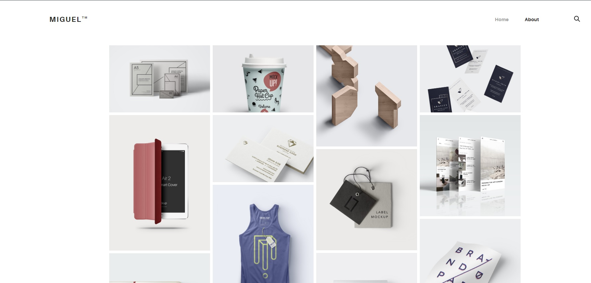

# Portafolio

Proyecto realizado en  [Angular CLI](https://github.com/angular/angular-cli) version 10.0.8.

## Objetivo

+ Cargar una plantilla HTML y convertirla en Angular.
+ Conexion con Firebase.

## Visita el Proyecto

[Visita el proyecto](https://port-folio-3.netlify.app/#/home)

## 

## Lenguajes
+ Angular
+ Typescript

